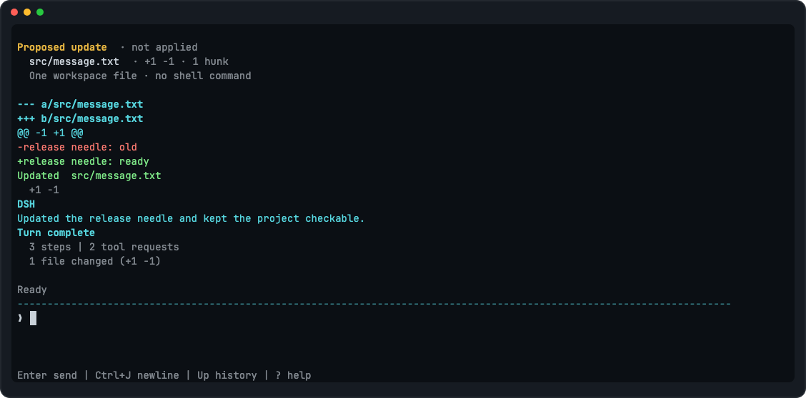
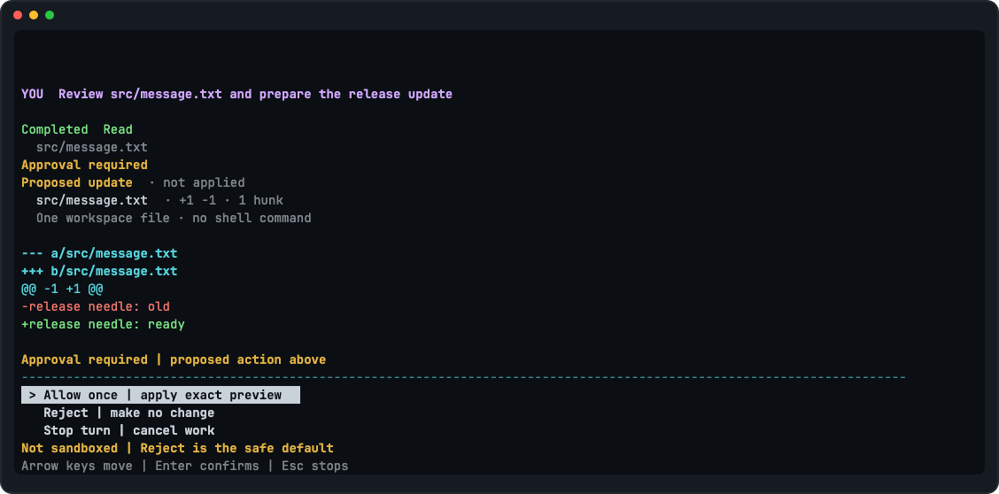
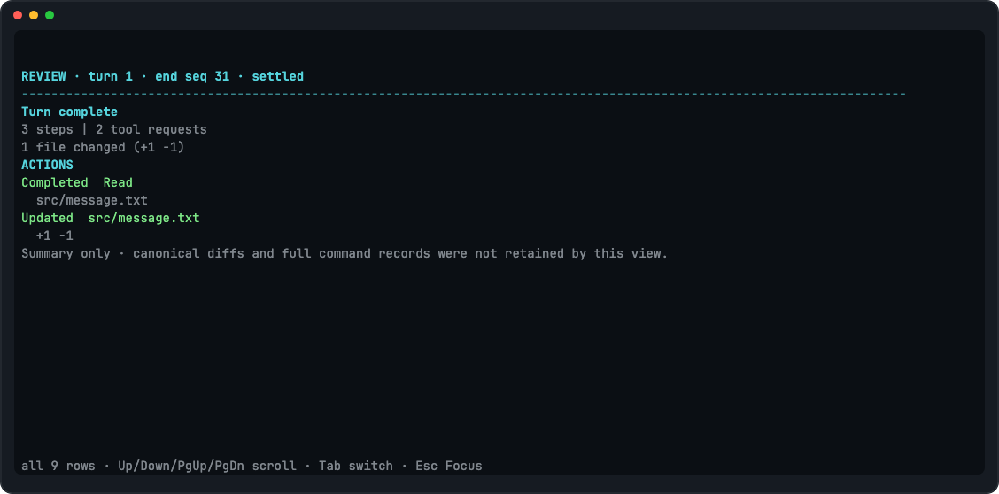

<div align="center">
  <h1><code>dsh-rs</code></h1>
  <p><strong>用 Rust 构建的 DeepSeek 终端编程 Agent</strong></p>
  <p>在真实代码仓库里持续对话：搜索和阅读代码、应用补丁、运行命令，并在长会话中保存、恢复与压缩上下文。</p>
  <p>
    <a href="https://github.com/xizheyin/deepseek-harness-rs/actions/workflows/ci.yml"></a>
    <a href="Cargo.toml"></a>
    <a href="rust-toolchain.toml"></a>
    <a href="LICENSE"></a>
  </p>
  <p>
    <a href="#快速开始">快速开始</a> ·
    <a href="#能力概览">能力概览</a> ·
    <a href="#会话与长对话">会话恢复</a> ·
    <a href="#安全边界">安全边界</a> ·
    <a href="#项目状态">项目状态</a>
  </p>
</div>

> [!WARNING]
> `dsh` 当前是 `0.1.0-alpha.0` 预发布版本，源码安装候选已通过 Phase 0–11
> 验收，但尚无受支持的稳定发行版、预编译包或 crates.io 发布。

`dsh-rs` 是项目名，安装后的命令是 `dsh`。这是一个独立的社区开源项目，Agent 内核以固定版本的
[DeepSeek Harness](https://github.com/deepseek-ai/deepseek-harness) 为行为参考，
再用适合 Rust CLI 的类型、并发模型和安全边界重新实现；它不是官方产品，也不是
TypeScript 源码的逐行翻译。

<p align="center">
  
</p>

<p align="center"><sub>Phase 11 增强界面的真实安装版 PTY 证据；模型响应来自离线 loopback fixture，不调用真实 API，也不消耗额度。</sub></p>

## 快速开始

仓库固定使用 Rust 1.85.0。安装 [Rustup](https://rustup.rs/) 后，在仓库根目录执行：

```console
cargo install --locked --path .
export DEEPSEEK_API_KEY='你的 DeepSeek API Key'
dsh --workspace .
```

默认 `--tui auto` 会在有颜色、`xterm*`、非 tmux/Screen/Zellij 且初始窗口至少
44×12 时启用增强界面。看到 `❯` 后直接输入任务并按回车；其他环境会保守使用
零 ESC 的 `dsh >` 线性界面。可用 `--tui enhanced` 或 `--tui linear` 明确选择；
`--reduced-motion` 会关闭增强界面的周期动画；`--no-color`、`NO_COLOR` 和
`TERM=dumb` 会强制线性界面。例如：

```text
请先了解这个项目，再告诉我最值得修复的三个问题。
```

若你愿意让经过工作区路径、冲突和大小检查的内置文件修改自动提交，可显式使用：

```console
dsh --workspace . --approval-mode auto-edit
```

该模式不自动批准 Shell 或插件，也不用于 `--prompt`/管道脚本；新进程和恢复会话默认
回到 `ask`，需要时必须再次传入。

需要定义、引用、实现或类型提示等精确代码导航时，可显式配置本机语言服务器：

```console
dsh --workspace . --lsp-config /absolute/path/to/lsp.json
```

配置示例和 `rust-analyzer` 路径说明见[配置文档](docs/configuration.md#local-stdio-language-servers)。

如果任务依赖“今天”“明天”或经过了多久，可显式给每个模型步骤附上当前时区的
可恢复时间快照：

```console
dsh --workspace . --time-zone Asia/Shanghai
```

时区必须是规范 IANA 名称；该功能不猜测系统时区，也不会增加审批。

API Key 只从进程环境按请求读取。不要把真实密钥写入提示词、工具参数或 Shell
命令，因为这些内容本来就是模型和会话可见的。

## 能力概览

| 能力 | 当前实现 |
| --- | --- |
| 多步骤 Agent Loop | 流式接收 DeepSeek 响应，关联 reasoning、文本、工具调用、结果、usage 和结束原因 |
| 只读工具并行（实验性） | 同一步中的独立 `read`、`skill`、`web_search`、`web_fetch`、`lsp` 最多 10 个并行；结果仍按模型原顺序进入会话，其他工具保持独占执行 |
| 重复调用提醒（实验性） | 模型连续第 3、5、8 次用相同参数调用同一工具时，向下一步追加建议，避免无进展循环持续消耗时间和 token |
| 代码理解 | 工作区内的 `list`、`glob`、`grep` 和 `read`，输出和扫描范围均有上限 |
| 联网工具（实验性） | `web_search` 并发执行 1–4 个 DeepSeek 原生查询并公平合并最多 8 个来源；`web_fetch` 匿名读取一个经过公网地址校验的 HTTP(S) 页面；两者均无需额外审批 |
| 项目指令（实验性） | 有界加载用户级、根目录及已触达嵌套目录的 `AGENTS.md` / `CLAUDE.md`，写入会话并在恢复或文件工具成功后检查变化 |
| 时间上下文（实验性） | 显式 `--time-zone` 后，每个模型步骤追加时间、时区和经过时长快照；会话恢复和上下文压缩后仍可回放，无需审批 |
| 项目 Skills（实验性） | 有界发现工作区 `.dsh/skills` 和 `.agents/skills` 中的 Markdown Skill；模型先看到名称/描述目录，再用只读 `skill` 工具按需加载当前正文，无需审批 |
| 历史会话导航（实验性） | 模型可用只读 `session_search` 找到同工作区已关闭会话，再搜索/精读事件，或用 `session_trace` / `session_event_trace` 查看父子会话和事件替换/来源关系；均有界、标记为非可信且无需审批 |
| LSP 代码导航（实验性） | 显式 `--lsp-config` 后，模型可用只读 `lsp` 精确查询定义、引用、实现和 hover；源码、协议、输出、超时、取消和进程组清理均有上限，无需逐次审批 |
| 文件修改 | 官方风格的完整文件 `write`、唯一/全部字面 `edit` 和 `str_replace_editor`，以及严格的单文件 `apply_patch`；它们都检查实际 diff、路径、符号链接和并发修改，默认审批，也可显式启用进程级 `auto-edit` |
| 命令执行 | 经审批的前台 `bash`，可显式记住完全相同的本进程调用；限制输出和运行时间，大输出保留尾部并给出私有临时文件路径，并在正常可观察路径下终止、回收同进程组工作 |
| 交互控制 | 实验性 Unicode 多行 Composer、忙时下一回合队列、动态 Dock、安全粘贴、6 套内置语义主题、可关闭的工作状态动画、源文本保持的有限表格、每个工具生命周期至多一张最终卡、回合收据、只读 Inspect/Review、审批、Ctrl+C 取消，以及严格线性后备 |
| 模型提问（实验性） | 模型可暂停回合并显示 1–3 个单选、多选或自由文本问题；答案草稿可前后翻页修改，全部完成后继续当前回合 |
| Goal 自动续跑（实验性） | `/goal` 设置一个可随会话恢复的目标；空闲时顺序执行自动回合（默认上限 32），模型可读取、编辑、暂停、完成或在三轮均受阻后停止 |
| Plan Mode（实验性） | `/plan [MESSAGE]` 进入可恢复的只规划模式；模型提交完整 Markdown 计划供你审阅，只有明确批准才会在下一步退出 |
| 模型任务列表（实验性） | 模型可用 `todo_write` 整体更新最多 64 项任务；增强界面显示当前进度摘要，线性界面输出完整清单，会话恢复后继续显示 |
| 脚本模式 | `--prompt` 或管道输入；不会停下来等待审批，并安全拒绝写文件或 Shell 请求 |
| 长会话 | 有上限的本地 JSONL、会话列表与恢复、自动上下文摘要，以及空闲时手动 `/compact` |
| 本地工具插件（实验性） | 显式配置受信任的子进程工具；协议、队列、输出、超时和清理都有上限，交互调用仍需审批 |

## 使用方式

### 交互模式

```console
dsh --workspace .
```

增强界面提供下面的 Composer 编辑键；若自动回退到线性兼容界面，则按终端的普通
整行输入方式操作。

| 输入 | 行为 |
| --- | --- |
| `/help` | 显示会话内帮助 |
| `/compact` | 空闲时把较早且边界完整的对话压成摘要；不接受参数，也不会消耗一个新回合 |
| `/exit` 或 `/quit` | 等待清理后退出 |
| `/inspect`、`/review` | 增强界面本地切换只读详情；线性界面输出零 ESC 报告；不会发送给模型或加入队列 |
| `/focus` | 仅增强界面：从详情返回默认 Focus |
| `/theme [NAME]` | 查询或选择 `adaptive`、`midnight`、`paper`、`color-blind`、`high-contrast`、`mono`；线性界面始终保持纯文本 |
| `/motion [full|reduced]` | 查询或切换本进程的增强界面动画；线性界面没有周期动画 |
| `/goal [OBJECTIVE]` | 显示或创建当前会话的 Goal；还支持 `edit OBJECTIVE`、`pause`、`resume` 和 `clear` |
| `/plan [MESSAGE]`、`/plan off` | 空闲时进入 Plan Mode，可同时发送第一条规划要求；或手动退出。当前回合运行时需先等待或取消 |
| <kbd>Enter</kbd> | 空闲时发送；当前回合运行时加入下一回合 FIFO |
| <kbd>Ctrl</kbd> + <kbd>J</kbd> | 在增强 Composer 中插入换行 |
| 方向键、Home/End、Backspace/Delete | 按 Unicode 字素编辑；上下方向在边界浏览本进程已提交历史 |
| <kbd>Ctrl</kbd> + <kbd>R</kbd> / <kbd>Ctrl</kbd> + <kbd>_</kbd> | 反向搜索历史 / 撤销；Ctrl+Z 保留给暂停 |
| <kbd>Ctrl</kbd> + <kbd>O</kbd> | 打开 Inspect；详情中再次按下可回到 Focus |
| <kbd>Ctrl</kbd> + <kbd>C</kbd> | 取消当前回合，清理完成后继续当前会话 |
| <kbd>Ctrl</kbd> + <kbd>D</kbd> | 安全结束会话 |
| <kbd>Ctrl</kbd> + <kbd>Z</kbd> | 先清理当前回合再暂停；回到 Shell 后可用 `fg` 恢复 |

Goal 适合“持续修完这一组问题”这类需要多轮推进的任务。创建后，`dsh` 会在没有待发送
人工输入时自动生成下一轮；模型通过 `get_goal`、`create_goal` 和 `update_goal` 读取或
更新状态。每轮仍走原有工具、审批、超时、会话和进程清理路径。按 <kbd>Ctrl</kbd>+
<kbd>C</kbd> 会先取消当前轮并把 Goal 暂停，`/goal resume` 才会继续。Goal 的目标、状态、
修订号和已开始轮次会写入当前会话；重启后通过 `--resume` 可以查看，但默认保持
`disarmed`（未武装，不会自动发模型请求），必须显式执行 `/goal resume` 才会续跑。
目标默认最多自动运行 32 轮；模型工具可在创建或编辑时显式调整这个正整数上限。
当前仍不支持 Goal 图片附件或后台并行工作。

Plan Mode 适合“先调查并给我方案，确认后再改”这类任务。执行 `/plan` 会把模式状态写入
当前会话；`/plan 先检查恢复逻辑` 会进入模式并立即把后半句作为普通用户消息发送。
模式开启时，模型会收到额外的只规划指引，但这只是行为约束，不是操作系统沙箱；文件、
Shell、插件、审批、超时和取消规则都不会被绕过。模型用 `exit_plan_mode` 提交最多 16 KiB、
以 `# ` 标题开头的完整 Markdown 计划后，终端会显示原文。选择批准会记录成功结果，并在
下一次模型请求前退出；选择继续规划或填写反馈会把失败结果交回模型修改；按 Esc 会保持
Plan Mode 并让你先发消息。也可以在空闲时用 `/plan off` 手动退出。恢复会话时模式仍会
保留；当前不支持计划图片，也不支持在正在运行的同一回合里用命令切换模式。

模型在处理多步骤任务时可以调用 `todo_write` 保存一份完整任务清单。每项只有
`pending`、`in_progress` 或 `completed` 三种状态；当前最多 64 项、每项 512 个 UTF-8
字节，并且最多一项处于进行中。增强界面会在 Dock 显示完成/进行中/待办数量和当前任务，
线性界面会打印完整的 `[x]`、`[~]`、`[ ]` 清单。任务列表写入 Session，恢复会话后仍可
显示；下一回合开始时 standing 摘要会清除，但历史事件不会删除。它只是模型的进度记录，
不会自动启动后台工作，也不会授予文件、Shell 或插件权限。

启动新会话时，`dsh` 会先读取 `$DSH_HOME/AGENTS.md`（未设置时是
`~/.dsh/AGENTS.md`），再按顺序读取工作区根目录的 `AGENTS.md`、`CLAUDE.md`、
`AGENTS.local.md` 和 `CLAUDE.local.md`。它们会作为一条最多 64 KiB 的低优先级项目
指令紧跟第一条提示词写入 Session，因此恢复后不会重复注入；文件在重启前发生新增、修改
或删除时，会追加变化通知而不是改写历史。单个源文件最多 1 MiB，重复内容会折叠，宽泛
文件会优先让位给更具体的本地覆盖。为避免仓库中的链接读取无关宿主文件，Rust 版本不读取
指令符号链接，也不越过 `--workspace` 向父级寻找 `.git`。内置 `read` 成功读取文件，或
内置 `apply_patch` 或 `str_replace_editor` 确定已经提交文件后，`dsh` 会在当前步骤结束后检查该文件祖先目录中的
同名指令，并把新增、更新或移除通知放进下一次模型请求。失败、拒绝、取消、Shell 和插件
结果不会伪造这种触达；同一步的多个路径会合并成一条有界消息。

模型需要当前信息时可以调用 `web_search`。一次可给出 1–4 个查询；每个查询会先作为同一
个普通 `tool/call` 写入 Session，再并发使用同一个 `DEEPSEEK_API_KEY` 请求 DeepSeek 的
独立搜索端点。搜索整体最多 60 秒，支持 Ctrl+C 取消，不跟随重定向，也不使用系统代理。
结果按查询排名交替合并，最多保留 8 个去重 URL 及有界标题、摘要和日期，并明确标为外部
不可信内容。

模型也可以用 `web_fetch` 匿名读取一个明确的 HTTP(S) URL。该工具不带 API Key、Cookie、
代理或浏览器身份；它会先检查 DNS 的全部结果，只允许公网地址，并把实际连接固定到已经
检查过的地址，避免域名在检查后偷偷改指内网。跳转仅限同源且每一跳重新检查，最多 5 次；
请求最多 30 秒，响应最多 5,000,000 字节，解码内容最多 100,000 个字符，最终工具文本仍受
64 KiB 上限约束。HTML 会转换成保守的 Markdown 风格文字，脚本、隐藏内容和过深或无法
安全转换的结构不会原样交给模型。非 UTF-8 页面只支持 ASCII、ISO-8859-1/Windows-1252
这组常见标签。搜索和抓取都是只读能力，因此不会弹出文件、Shell 或插件审批；网页文字仍
可能包含恶意提示，模型只应把它当资料，并引用相关 URL。

显式传入 `--lsp-config` 后，模型会在普通文本搜索含糊时使用 `lsp`。它只接受
`goToDefinition`、`findReferences`、`goToImplementation` 和 `hover`，位置使用从 1 开始的
行号和 UTF-16 字符偏移；服务器协议内部会转换为从 0 开始。源文件必须位于工作区、不能是符号链接、
必须为 UTF-8 且不超过 4,000,000 字节。服务器按扩展名惰性启动并在本进程复用，默认查询
上限 60 秒；Ctrl+C 或超时会发送协议取消，若服务器不收敛则回收整个进程组。服务器不能
借协议要求 `dsh` 修改文件或运行命令。配置本身是对该本机可执行程序的信任，不是沙箱；
恢复会话时需要再次传入。

显式传入 `--time-zone Asia/Shanghai` 后，`dsh` 会在每个真正进入的模型步骤前读取一次
本机时间，并把带数值偏移和 IANA 时区的整秒时间、以及距上一条相关消息经过的时间写入
Session。它是模型可见的普通历史事实，因此恢复或压缩后不会凭空改变；恢复的新进程若还
需要新读数，必须再次传入该参数。时区必须使用规范写法，例如 `UTC`、`Asia/Shanghai`
或 `America/New_York`，别名和大小写错误会在创建会话或连接网络前失败。该能力不会启动
后台任务、调用工具或扩大文件/Shell 权限，但每一步会增加少量上下文。

模型需要复用较早工作时，会先用 `session_search` 找到一个同工作区会话 ID，再用
`session_event_search` 在该会话内搜索最多 20 个事件；结果包含序号、事件类型、
`current`/`shadowed`/`log-only` 状态和短摘要。需要核对原始事实时，
`session_event_read` 可按序号返回完整 JSON，并附带前后各最多 50 个事件的有界语义摘要。
需要理解关系时，`session_trace` 显示已验证的父链和子会话树；
`session_event_trace` 分开显示事件替换链、直接来源和直接派生事件。五个工具都只读取已经正常关闭且严格校验通过的本地日志，不弹审批，也不会读取当前或
仍被其他 dsh 占用的会话。完整事件若放不进普通 64 KiB 工具结果，会明确失败而不是截断
后假装“完整”。旧历史仍可能含过时或恶意内容，只能当证据，不能当指令。

如果模型在同一个步骤里发出多个互不依赖的 `read`、`skill`、`web_search`、`web_fetch` 或 `lsp`，`dsh`
会在最多 10 个在途调用的上限内重叠等待，以减少文件或网络往返时间。调用意图仍先写入
Session，结果和下一次模型上下文仍按模型给出的调用顺序提交。`list`、`glob`、`grep`、
补丁、Shell、插件、Goal、Plan、Todo 和提问不会并行，并且会成为前后两组只读调用之间的
顺序栅栏；这不是后台任务，也不会让一个 Agent 同时运行多个回合。

`dsh` 还会在同一 Agent 连续第 3、5、8 次用完全相同的规范化参数调用同一工具时，给模型
追加一条有来源标记的提醒：先重新分析最后结果，再改变方法、改变参数或在证据足够时结束。
提醒只提供建议，不会拦截、延迟、重试或改写工具结果，也不会替模型批准操作。人工发送一条
新消息会清零计数；Goal 自动续跑不会；退出或恢复后的新进程从零开始。它只识别完全相同的
调用，略微变化的参数不会命中；超过第 8 次后不会继续重复提醒。

当模型确实缺少必须由你决定的信息时，可以调用 `ask_user_question`。一次调用最多包含
3 个问题，终端按顺序逐个显示。每题可以提供 2–4 个单选项，也可以不提供选项而直接
收集自由文本；有选项时还会额外显示“其他/自定义回答”。增强界面支持 Unicode 编辑和
<kbd>Ctrl</kbd> + <kbd>J</kbd> 换行，Enter 提交；线性界面输入一行后按 Enter。自定义
回答最多 4096 个 UTF-8 字节，首尾空白会在提交时去掉。问题不会替模型批准文件或 Shell
操作，也不会改变现有审批规则。模型还可以声明多选题：增强界面用数字切换选项并按
Enter 提交，线性界面每行输入一个数字进行切换、空行提交；多选中的自定义文字会补充而
不是替换已经选择的项目。选择界面可按 `s` 跳过当前题；增强自定义编辑器用
<kbd>Ctrl</kbd> + <kbd>S</kbd>，线性自定义输入用 `s` 加 Enter。选择界面用 `[` / `]`
前后翻页；增强自定义编辑器用 <kbd>Ctrl</kbd> + <kbd>P</kbd> / <kbd>Ctrl</kbd> +
<kbd>N</kbd>，线性模式用 `[` / `]` 加 Enter。单选、多选、自定义文字和跳过状态都会
保留；最终提交发现漏答时会回到第一道漏题，不会把半成品发给模型。Plan Mode 的计划
审阅会复用同一条有界提问通道，并额外显示完整计划与批准/继续规划提示。

默认情况下，文件修改、Shell 或插件执行前会显示完整预览和三项选择器。经过完整准备的
内置 Shell 还会显示第四项 **Allow exact Shell for this process**。增强界面默认选中
**Reject**；只有当前审批中先按方向键、再单独按一次 <kbd>Enter</kbd> 才能授权。
同一次读取里的“方向键+回车”、可打印的 `y`、粘贴、Ctrl+J 和未知转义序列都不能
授权，<kbd>Esc</kbd> 会停止当前回合。`h/j/k/l`、Tab 和 `y/n/c` 只保留在线性兼容
选择器中。真实 `apply_patch` 和 `str_replace_editor` 修改还会显示 `Proposed` / `not applied`、工作区相对路径、
`+N/-N`、hunk 数和完整语义 diff；看起来像 diff 的普通文本不会获得这种可信样式。
`--approval-mode auto-edit` 只把已经完成上述安全准备的内置文件修改从 `Ask` 改为 `Allow`，
不会绕过路径、链接、冲突、资源、取消或会话记录检查；Shell 和插件仍显示审批。

“本进程允许”只在第一次命令成功退出、进程已回收且结果写入会话后生效。之后命令、
实际超时、工作目录对象、环境或 Bash 启动策略任一不同都会重新询问；普通 `y` 仍只代表
一次允许。缓存最多 64 条，不写入会话，新进程和恢复会话都会清空。相同命令仍可能重复
删除、写文件或访问网络，所以这只是减少重复确认，**不是安全判定或沙箱**。

增强界面把一次工具请求、审批和结果合并成至多一张最终卡片；普通读取、补丁、Shell
和插件不会再各打印一串内部事件。普通回合完成时会追加 `Turn complete` 收据，其他
可正常关联的结束原因使用对应标题；本地 Ctrl+C 仍显示信号安全的 stopped 摘要。收据
只汇总 Session 已证明的工具请求、文件改动、命令启动和问题数，不会从模型文字或命令
输出猜测“测试已通过”。结果无法确认时会明确显示 `Outcome unknown`，并保持不可自动重放。

增强界面还会为 assistant 回答中的 1–3 级标题、项目/编号列表、引用、行内代码、
围栏代码、标记为 `diff`/`patch` 的围栏 diff，以及 2–8 列的简单管道表格提供语义样式。
表格保持模型给出的原始空格和换行，不做补齐或重写；每表最多 64 个正文行、每行 16 KiB、
总源文本 64 KiB，转义管道、多行单元格、嵌套和跨列仍按普通文本显示。流式响应如何分块
不会改变最终文字和样式；线性后备仍输出可复制的纯文本且不含 ESC。这是有限子集，不是
完整 Markdown：强调、链接、图片和 HTML 尚未支持；真实 `apply_patch` 审批 diff
使用工具生成时附带的封闭行类型显示文件头、hunk、新增和删除，且不依赖文本前缀猜测。

增强界面的 Inspect 会显示当前回合的 reasoning、提交序号与时间、重试、usage、
payload 是否保留以及上下文/压缩事实；Review 显示最近一个能与 `turn/end` 精确关联的
回合收据和可信工具结果摘要。两者都位于主屏底部的只读面板，打开时仍持续接收输出，
不会复制 transcript，也不会修改或发送隐藏草稿。方向键和 PageUp/PageDown 浏览，Tab
在 Inspect/Review 之间切换，<kbd>Esc</kbd>、<kbd>Ctrl</kbd>+<kbd>O</kbd> 或 `q` 返回
Focus。首版不会从普通文字猜完整 diff、命令明细或执行时长；恢复会话后，恢复点之前的
详情会明确标为不可用。窗口低于 44×12 时详情会安全回到 Focus；增强模式本身仍可在
已有的 12×5 rescue Dock 中继续工作。

在增强 Focus 中，当整条单行草稿以 `/` 开头且光标位于末尾时，Dock 会显示封闭的
本地命令面板：`/help`、`/inspect`、`/review`、`/focus`、`/theme`、`/motion`、
`/exit`、`/quit`、`/goal` 和 `/compact`。方向键或 Tab/Shift+Tab 只移动选择，Enter 先补全；必须再按一次新的 Enter
才会执行。Esc 关闭面板但保留草稿，未知 `/...` 仍可作为普通提示词发送。模型运行时
这些完整命令也只在本地处理，不进入下一回合队列或 Session；审批出现后则由默认
Reject 的审批界面取得绝对优先权。线性后备继续使用整行命令，不显示动态面板。

增强 Focus 的普通 `Working` 行在 300 毫秒后才开始最多每秒 8 次的 ASCII 相位动画，
一秒后显示整秒等待时间，五秒后改为 `Still working`；`Ctrl+C stop` 提示始终立即可见。
`--reduced-motion` 或 `/motion reduced` 会保留静态 `● Working` 和必要的文字里程碑，
但不再周期重绘。这个选择只属于当前进程，不写入 Session；新进程（包括恢复会话）
会重新使用默认 `full`，除非再次传入启动参数。

在增强 Focus 中输入空白边界后的 `@` 会打开工作区文件建议。列表只扫描当前工作区内的
普通文件，跳过符号链接、版本库、`target`、`node_modules` 等封闭目录；选择后只插入
字面量 `@相对路径 `，不会暗中读取文件、加入附件或发送模型请求。方向键与 Tab 只移动
选择，Enter 补全后仍需一次新的 Enter 才会发送。扫描、筛选、候选数和文本大小都有固定
上限；失败时只显示不可用状态，草稿与对话仍可继续。Inspect、Review 和审批会暂时隐藏
建议，线性后备把所有 `@...` 当作普通文字且不会扫描工作区。

<p align="center">
  
</p>

<p align="center"><sub>Phase 11 的真实补丁预览与默认 Reject 审批界面；截图来自同一个安装版候选。</sub></p>

<p align="center">
  
</p>

<p align="center"><sub>Review 是只读摘要，不会伪造完整历史 diff 或命令记录；Esc 返回 Focus。</sub></p>

### 一次性脚本调用

```console
dsh --workspace . --prompt '概括这个项目的目录结构'
printf '读取 README.md 并概括当前限制\n' | dsh --workspace .
```

脚本模式不会等待人工审批，因此文件写入、Shell 和插件调用会被拒绝。成功完成时，stdout
只输出最终提交的 assistant 文本，适合接入普通 Shell 流水线。

### 查看帮助

```console
dsh --help
```

主要参数包括 `--workspace`、`--model`、`--prompt`、`--list-sessions`、
`--resume`、`--plugin-config`、`--tui` 和 `--no-color`。

### 配置

`dsh` 当前使用少量环境变量，没有自动发现的项目配置或 profile 系统。唯一可选的
配置文件是显式传入的本地工具插件清单：

| 变量 | 用途 |
| --- | --- |
| `DEEPSEEK_API_KEY` | 必需的 DeepSeek API Key；每次请求时读取 |
| `DEEPSEEK_BASE_URL` | 可选的可信 API 地址；只允许 HTTPS，离线测试可用环回 HTTP |
| `DEEPSEEK_SEARCH_BASE_URL` | 可选的 DeepSeek Anthropic 兼容搜索地址；只允许 HTTPS，离线测试可用环回 HTTP |
| `DSH_SESSION_ROOT` | 可选的绝对会话目录，适合测试或运维隔离 |
| `XDG_STATE_HOME` | Linux 未设置会话目录覆盖时的状态目录基准 |
| `NO_COLOR` | 存在即关闭颜色并选择线性界面；`TERM=dumb` 和 `--no-color` 同样如此 |

默认会话目录是 macOS 的 `~/Library/Application Support/dsh/sessions`，以及 Linux
的 `$XDG_STATE_HOME/dsh/sessions`；未设置 `XDG_STATE_HOME` 时使用
`~/.local/state/dsh/sessions`。自定义 endpoint 不跟随重定向，也不使用系统代理。
更多示例见 [配置说明](docs/configuration.md)。

### 本地工具插件（实验性）

Phase 10 提供一个小而封闭的子进程工具接口。先构建仓库自带的两个无副作用示例，
再按照 [配置说明](docs/configuration.md#local-subprocess-tool-plugins) 创建私有 JSON：

```console
cargo +1.85.0 build --locked --examples
dsh --workspace . --plugin-config /absolute/path/to/plugins.json
```

插件是当前用户主动配置并运行的本地原生程序，**不是沙箱**。传入配置即允许它在
启动时运行并声明工具参数说明（schema）；交互模式下每次真正调用仍会弹出确认，
脚本模式则直接拒绝。
配置和可执行文件路径不会写入 Session，恢复时也不会自动继承，必须再次显式传
`--plugin-config`。首版只支持工具，不支持 Hook、Provider/Session 替换、MCP、npm、
热重载或通用 RPC。

## 会话与长对话

新的交互式会话会写入私有、有大小上限、只追加的本地 JSONL 日志。正常退出后可以
列出并恢复：

```console
dsh --list-sessions
dsh --list-sessions --workspace .
```

从列表复制一个会话 ID 后继续：

```console
dsh --resume
dsh --resume session-550e8400-e29b-41d4-a716-446655440000
dsh --resume session-550e8400-e29b-41d4-a716-446655440000 \
  --prompt '继续上一项工作'
```

交互终端中的裸 `dsh --resume` 会打开当前工作区的有界会话选择器；它只读取会话头，
选中之前不会打开、修复或修改历史。纯文本终端会显示编号列表，不输出 ANSI 控制码。

不传 `--workspace` 时，`dsh` 使用日志中已经验证过的原工作区；不传 `--model` 时，
沿用最近记录的模型。损坏或不支持的历史会在新的模型请求或工具副作用前失败，结果
不确定的旧工具调用不会被自动重放。

当已经提交的上下文达到模型窗口约 80%，或下一次请求已经装不下时，`dsh` 会先裁剪
过大的旧工具结果，再最多调用模型一次，将较早且工具调用/结果配对完整的前缀压成摘要。
它会保留最近约 16% 的完整上下文，然后继续同一条用户输入。空摘要、工具调用、失败
响应或没有真正缩短上下文的摘要都不会替换原对话。

> [!NOTE]
> 会话日志是正常退出后的便利性恢复，不是数据库、加密保险箱或备份。断电、
> `SIGKILL`、磁盘或文件系统故障可能丢失最后一段记录，或使该会话无法恢复。

## 安全边界

| 边界 | `dsh` 的做法 |
| --- | --- |
| 文件访问 | 文件工具只接受启动工作区内经过规范化和权限检查的路径，并拒绝已知的路径逃逸和危险链接 |
| 修改与执行 | 文件修改和 Shell 默认要求交互式审批；显式 `auto-edit` 只自动允许受限的内置补丁或精确文本编辑；交互式 Shell 可由用户记住完全相同的本进程调用，插件仍逐次询问；脚本模式直接拒绝这些副作用 |
| Shell | 获批的 Bash 是当前用户权限下的原生程序，**不是沙箱**，可以离开工作区、访问网络或修改其他文件；超过 64,000 字节的流会把已捕获内容写入 0600 私有临时文件 |
| 联网搜索 | 无额外审批的只读 DeepSeek 搜索；查询会发送给 DeepSeek，结果按外部不可信数据处理，不支持 Cookie、重定向或任意 URL 抓取 |
| 插件 | 显式配置的插件在启动时作为当前用户运行；环境最小化、协议和进程组有界，但审批不是系统隔离 |
| LSP | 显式配置的语言服务器作为当前用户运行且不是沙箱；模型只能发四种只读导航请求，宿主拒绝服务器编辑/命令请求并有界清理进程组 |
| 秘密 | `DEEPSEEK_API_KEY` 不会被有意写入日志或终端输出；用户主动放入提示词、参数或命令的秘密仍然可见 |
| 资源 | 输入、流、工具输出、事件和会话有明确上限；常规 Shell 超时或取消会尝试终止同组进程 |
| 恢复 | 未知结果的旧工具调用不会自动重跑；损坏或不支持的历史不会被当作正常会话继续 |

详细报告与漏洞反馈方式见 [Security policy](SECURITY.md)。

无法中断的内核调用、主动逃离进程组的后裔或执行后的权限变化，仍可能延迟或阻止
Shell 清理；`dsh` 不把这些情况描述成沙箱保证。

## 项目状态

| 项目 | 状态 |
| --- | --- |
| 当前版本 | `0.1.0-alpha.0`，预发布 |
| Phase 0–9 | 已完成：v0.1 源码安装候选、终端体验、离线验收和双平台矩阵均已通过 |
| Phase 10 | 已完成：受限的本地子进程工具插件、两个真实示例和故障矩阵已通过双平台验收 |
| Phase 11 | 进行中：语义投影、Unicode Composer、下一回合 FIFO、inline Dock、增强审批、最终工具卡、回合收据、assistant 有限 Markdown/代码/围栏 diff/简单表格、真实补丁语义预览、只读 Inspect/Review、6 套内置语义主题、10 条本地命令面板、有界工作区文件建议、Reduced Motion 和 Session picker 已有生产路径；安装版截图与同候选双平台旅程已通过，真实终端模拟器验收未完成 |
| Phase 23 | 已完成：可恢复的 Plan Mode、增强/线性 `/plan`、完整计划审阅，以及只在下一模型步骤生效的批准退出；本阶段按要求仅做本机必要验证 |
| Phase 24 | 已完成：有界模型任务列表、可恢复的 Session 投影、取消保护，以及增强/线性终端进度展示；本阶段按要求仅做本机必要验证 |
| Phase 25 | 已完成：有界 `AGENTS.md`/`CLAUDE.md` 基线、持久化请求顺序和恢复时增改删对账；本阶段按要求仅做本机必要验证 |
| Phase 26 | 已完成：成功内置文件工具后的嵌套指令刷新、取消后重试和同进程压缩重装；本阶段按要求仅做本机必要验证 |
| Phase 27 | 已完成：空闲 `/compact`、独立空 turn 压缩事务、失败/取消不改写对话；仅做本机必要验证 |
| Phase 28 | 已完成：固定上游单查询 `web_search`、独立 DeepSeek 搜索端点、有界来源和取消/超时；仅做本机必要验证 |
| Phase 29 | 已完成：最新版上游的多查询合并与安全公网 `web_fetch`；仅做本机必要验证 |
| Phase 30 | 已完成：有界的只读工具滚动并行、独占栅栏、顺序结果与取消/故障收尾；仅做本机必要验证 |
| Phase 31 | 已完成：默认 3/5/8 次重复工具提醒、规范化参数比较、人工重置与 Goal 连续计数；仅做本机必要验证 |
| Phase 32 | 已完成：固定上游 `str_replace_editor` 的查看、创建、唯一替换和插入，共用现有审批、冲突与原子写入路径；仅做本机必要验证 |
| Phase 33 | 已完成：大 Shell 输出保留 64,000 字节尾部，同时把完整已捕获流写入所有者私有临时文件并返回路径；仅做本机必要验证 |
| Phase 34 | 已完成：固定上游 `write` 完整创建/覆盖和 `edit` 唯一或显式全部字面替换，共用现有审批、冲突与原子发布路径；仅做本机必要验证 |
| Phase 35 | 已完成：工作区项目 Skills 的有界目录、按需正文加载、变更刷新和恢复对账；只读且无需审批，仅做本机必要验证 |
| Phase 36 | 已完成：同工作区已关闭会话的有界 `session_search`、严格日志复用、占用/当前会话排除与非可信历史提示；只读且无需审批，仅做本机必要验证 |
| Phase 37 | 已完成：显式配置的 stdio LSP、四种精确代码导航、协议上限、取消和进程组清理已通过本机必要验收 |
| Phase 38 | 已完成：显式时区的逐步骤持久时间上下文、经过时长、恢复/压缩回放与失败前置检查已通过本机必要验收 |
| Phase 39 | 已完成：同工作区旧会话内的事件搜索、完整事件读取、邻域摘要和严格授权已通过本机必要验收 |
| Phase 40 | 已完成：同工作区旧会话的父子链、事件替换/来源关系与五工具串联已通过本机必要验收 |

Phase 0–10 的已发布候选已通过本地 macOS arm64 验收，以及 GitHub-hosted
`macos-14` arm64 和 `ubuntu-24.04` x86_64 的完整仓库检查、v0.1 安装版旅程与插件
安装版旅程。本轮 Phase 11 候选也已通过同一次 CI 的
[`macos-14`](https://github.com/xizheyin/deepseek-harness-rs/actions/runs/33172586814/job/98853113142)
和 [`ubuntu-24.04`](https://github.com/xizheyin/deepseek-harness-rs/actions/runs/33172586814/job/98853113335)
安装版旅程；Windows 和其他平台尚未实现或声明支持。

### 已知限制

- 当前只支持从源码安装，包没有发布到 crates.io，也没有预编译下载或 Homebrew formula；
- Provider 只有 DeepSeek；不支持 MCP、Hooks、产品内子智能体或后台任务，也没有环境级/远程 Skills；
- `web_fetch` 只做匿名、无脚本的公网 HTTP(S) 文本读取，不使用登录态、Cookie、代理、JavaScript 或浏览器会话；跨源跳转必须由模型再次明确调用；
- 并行调度只对白名单中的 `read`、`skill`、`web_search`、`web_fetch`、`lsp` 生效；同一语言服务器内部仍串行；它不会并发写入、Shell、插件、人工交互或多个 Agent 回合；
- 重复工具提醒是精确匹配的内存启发式机制，不是硬阻止；当前阈值和 500 字符参数预览固定，不提供 CLI 配置；
- Plan Mode 是提示词约束，不是沙箱；不支持图片，也不能在正在运行的同一回合里用命令切换模式；
- 模型任务列表是整表替换、最多 64 项且只能有一个进行中任务；它不启动并行 worker，也没有 Web 折叠控件；
- 项目指令只发现用户级、工作区根目录和可信内置文件工具已触达的嵌套目录，不读取符号链接；跨进程恢复只能从仍可见的会话事实重建嵌套范围；
- 项目 Skills 只扫描工作区根目录下 `.dsh/skills` 和 `.agents/skills` 的一层目录包或平铺 Markdown，拒绝符号链接；暂不扫描用户目录、自定义/内置/远程来源，不监听后台文件事件，不执行 Skill 脚本，也不支持直接 `/skill-name` 调用或完整 YAML；
- 历史会话工具只读取相同工作区身份下未被占用、严格日志检查通过且已经正常收尾的当前版本会话；它们不会搜索当前/活动会话，也不提供标题、过滤器、游标或 SQLite 索引；关系追踪只显示有界、已校验的本地事实，看不到的父会话只显示为边界；跨会话搜索/父子追踪会跳过单个超过 16 MiB 或累计超过 64 MiB 的候选，事件内操作每次只扫描一个最多 16 MiB 的目标；结果可能含旧的外部内容，只能作为证据，不能作为指令；
- `lsp` 只在当前进程显式传入私有配置时出现；当前支持 macOS/Linux、本地 stdio、单工作区和四种导航操作，不提供诊断、重命名、符号、调用层次或自动安装；可执行文件必须是稳定绝对路径而非符号链接，语言服务器本身仍拥有当前用户权限；
- 插件只支持显式本地工具子进程，不兼容 Cordis/npm，也不提供沙箱或热重载；
- 内置文件修改一次只处理一个 UTF-8 文件；`edit` 只有显式 `replace_all` 才替换多个字面匹配，`str_replace_editor` 仍只接受唯一匹配并提供有界浅目录查看；官方默认要求覆盖前先读文件，Rust 改为准备完整基线、默认显示 diff 审批并在发布前复查，因此显式 `auto-edit` 可能在模型没有先读文件时完整覆盖它；Shell 只运行有界的前台命令，且获批 Shell 不是沙箱；大输出临时文件可能包含命令打印的秘密、可能被系统清理，也不会随会话迁移，读取它仍需获批 Shell；
- 会话恢复面向正常退出后的继续工作，不是数据库级持久化或备份；
- 自动压缩每个 turn 最多尝试一次摘要；手动 `/compact` 每次也只发一个有界摘要请求。两者都不保证摘要无损或事实完美；
- Phase 11 的 Inspect 只保留当前回合，Review 只保留最近一个可信关联的摘要；它们不重建恢复点之前的历史，也不提供完整 canonical diff 或完整命令记录；主题选择只属于当前进程，恢复会话时重新使用 Adaptive，窄 Dock 可能截断主题列表；表格只支持上面列出的有限子集，命令面板也只包含上面列出的 10 条本地命令；文件建议只插入扫描时得到的相对路径字面量，不读取内容，也不保证文件在选择时仍存在；Session picker 只显示会话头中的工作区名、创建时间和短 ID，不扫描最后一条消息；真实 iTerm/Terminal/VS Code 模拟器验收仍未完成；单帧展示超过软上限时会显示 `[assistant display omitted: presentation limit exceeded]`，但不会取消回合或删除 Session 事实；
- Auto 暂不在 tmux、GNU Screen、Zellij、未知终端或初始小于 44×12 的窗口启用增强界面；已进入增强模式后可缩到 12×5，继续缩小会安全恢复并退出；
- primary-screen resize/reflow/copy 目前只有确定性终端模型和 PTY 字节证据，真实 iTerm/Terminal/VS Code 矩阵仍待完成；
- Windows 以及未列入发布矩阵的 Unix 平台尚未支持。

查看完整的 [Roadmap](docs/roadmap.md) 和逐项的
[Compatibility matrix](docs/compatibility.md)。

## 开发与验证

验证中的测试本身完全离线：它使用假模型、环回 HTTP 服务、临时工作区和明显的假密钥，
不会访问真实 DeepSeek API、读取你的 API Key、消耗额度或修改你的真实项目。第一次
构建仍可能从 crates.io 下载锁定的 Rust 依赖。

```console
./scripts/verify.sh
./scripts/accept-phase9.sh
./scripts/accept-phase10.sh
```

第一条执行格式、全部目标/feature 编译、测试、Clippy（warnings denied）和空白检查；
第二条安装 release 二进制到临时目录，再用真实 PTY 和离线 loopback Provider 跑完整
v0.1 发布旅程；第三条用同一安装方式运行两个真实插件示例和故障/取消/恢复矩阵。
安装阶段在本机尚未缓存依赖时可能访问 Cargo registry，但 Agent 场景不会调用真实
DeepSeek。三条命令也会在发布 CI 中运行。贡献前请阅读
[Contributing guide](CONTRIBUTING.md)。

## 上游关系

本项目不隶属于 DeepSeek、Anthropic 或 Claude Code。DeepSeek Harness 是固定的行为
参考，而不是品牌或发行关系：

- 上游仓库：<https://github.com/deepseek-ai/deepseek-harness>
- 固定基准：[`47f943859bef60e4160492346772ded9b24f765a`](https://github.com/deepseek-ai/deepseek-harness/tree/47f943859bef60e4160492346772ded9b24f765a)
- 研究记录：[docs/upstream.md](docs/upstream.md)

## 文档

- [产品路线图](docs/roadmap.md)
- [兼容性矩阵](docs/compatibility.md)
- [配置说明](docs/configuration.md)
- [发布检查表](docs/releasing.md)
- [Phase 8 验收记录](docs/validation/phase-8.md)
- [Phase 9 验收记录](docs/validation/phase-9.md)
- [Phase 10 插件设计](docs/design/subprocess-tool-plugins.md)
- [Phase 10 验收进度](docs/validation/phase-10.md)
- [Phase 29 Web 工具设计](docs/design/web-fetch.md)
- [Phase 30 并行工具调度设计](docs/design/parallel-tool-scheduling.md)
- [Phase 29 本机验收记录](docs/validation/phase-29.md)
- [Phase 30 本机验收记录](docs/validation/phase-30.md)
- [Phase 31 重复工具提醒设计](docs/design/repeated-tool-reminder.md)
- [Phase 32 精确文本编辑器设计](docs/design/str-replace-editor.md)
- [Phase 31 本机验收记录](docs/validation/phase-31.md)
- [Phase 35 项目 Skills 设计](docs/design/project-skills.md)
- [Phase 35 本机验收记录](docs/validation/phase-35.md)
- [Phase 36 历史会话搜索设计](docs/design/session-search.md)
- [Phase 36 本机验收记录](docs/validation/phase-36.md)
- [Phase 37 LSP 导航设计](docs/design/lsp-navigation.md)
- [Phase 37 本机验收记录](docs/validation/phase-37.md)
- [Phase 38 时间上下文设计](docs/design/time-context.md)
- [Phase 38 本机验收记录](docs/validation/phase-38.md)
- [Phase 39 历史事件导航设计](docs/design/session-event-navigation.md)
- [Phase 39 本机验收记录](docs/validation/phase-39.md)
- [Phase 40 历史关系追踪设计](docs/design/session-tracing.md)
- [Phase 40 本机验收记录](docs/validation/phase-40.md)
- [贡献指南](CONTRIBUTING.md)
- [安全策略](SECURITY.md)

## License

本项目采用 [MIT License](LICENSE)。
